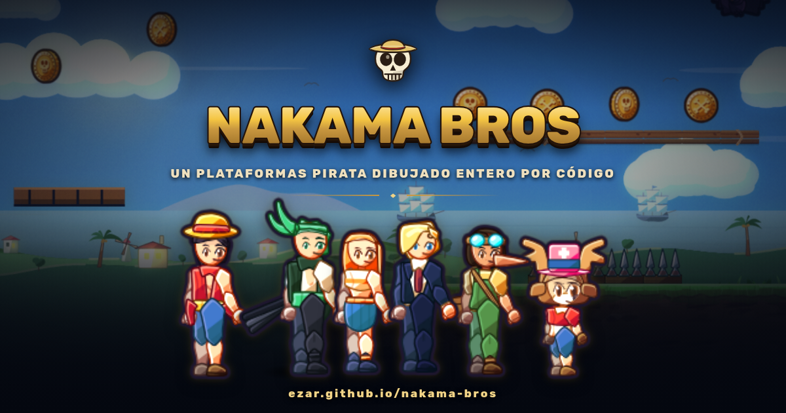

# Nakama Bros ☠️

Un plataformas 2D con la tripulación del Sombrero de Paja, con el listón puesto
en los clásicos del género: control preciso, arte con luz y una capa de efectos
que hace que cada golpe se sienta.

**▶ [Jugar](https://ezar.github.io/nakama-bros/)** — funciona en el navegador,
en el móvil y sin conexión.



Todo el arte se genera por código. No hay ni un asset de imagen en el
repositorio: sprites, tilesets, cielos, partículas y efectos se rasterizan en
canvas al arrancar, y la música y los efectos se sintetizan con WebAudio. Hasta
la imagen de arriba es un fotograma que el motor ha renderizado de verdad.

*(La única excepción es un dibujo hecho a mano que el juego entrega como premio.
Está ahí a propósito y se explica en `CLAUDE.md`.)*

## Qué hay

**Seis islas, diecinueve fases**, de East Blue a Wano. Cada isla termina en un
jefe —siete en total, porque East Blue tiene uno a mitad de camino— y cada jefe
pelea en tres actos, con aperturas distintas según lo tocado que esté.

**Diez tripulantes**, cada uno con su velocidad, su salto y su movimiento
propio. Tres dificultades, tres fragmentos de Poneglifo escondidos en cada una
de las diecinueve fases, y un rango de C a S al terminarla. La S pide todos los
fragmentos y una vuelta sin morir, y tiene premio.

### Correr contra alguien

- **Tu fantasma.** El juego graba siempre tu mejor vuelta. Actívalo en
  *Opciones → Fantasma* y corres contra tu propia sombra.
- **Retos por enlace.** Termina una fase, dale a **Retar**, y mándalo por donde
  quieras. **El enlace lleva la vuelta entera dentro**: quien lo abra corre
  contra tu sombra. Sin servidor, sin cuenta, sin subir nada.
- **Carrera en directo.** Dos aparatos en la misma red corriendo la misma fase a
  la vez, cada uno viendo al otro. Vale cualquier combinación —dos móviles, dos
  PCs, uno de cada— y se emparejan pasándose dos códigos. Tampoco hay servidor
  de por medio.

### Cosas que encontrar

Paredes que no están donde parecen, salas escondidas detrás de ellas, y un
multiplicador que sube mientras encadenes pisotones sin tocar el suelo.

## Jugar

```bash
npm install
npm run dev
```

| Acción | Teclado | Gamepad |
|---|---|---|
| Mover | ← → / A D | Stick o cruceta |
| Saltar | Espacio / Z / K | A |
| Atacar | X / J | B / X |
| Correr | Shift / C / L | Gatillos |
| Pausa | Esc | Start |

En móvil aparecen controles táctiles automáticamente, y todos los menús se
manejan también con teclado o mando.

## Desarrollo

```bash
npm run lint
npm run type-check
npm run test
npm run build
```

Para ver el arte que escribes —una captura del juego es demasiado pequeña para
revisar sprites— hace falta una build con los mandos de captura puestos:

```bash
npm run build:capture
node scripts/sheets.mjs --sheet crew:luffy --zoom 5   # hoja de contactos
node scripts/shoot.mjs                                # capturas del juego
```

La arquitectura está en [`CLAUDE.md`](./CLAUDE.md) y el diseño en
[`SPEC.md`](./SPEC.md). Ahí está también el porqué de las decisiones que no se
adivinan leyendo el código: por qué el fantasma guarda posiciones y no pulsaciones,
por qué un reto se verifica entero antes de leer una sola pose, y por qué cada
lado de una carrera simula su propia fase en vez de ponerse de acuerdo.

## Licencia y aviso legal

El código, las herramientas y el pipeline de arte de este repositorio son
© 2026 ezar y se publican bajo licencia [MIT](./LICENSE). Todo el arte que ves
sale de ese código: no hay ni un solo asset de imagen aquí, así que la licencia
cubre también los sprites, los tilesets, los cielos y los efectos.

**One Piece es obra de Eiichiro Oda** y es © Eiichiro Oda / Shueisha / Toei
Animation. Esto es un proyecto de fans **no oficial y sin ánimo de lucro**, sin
relación con ninguno de ellos ni respaldo por su parte. Los nombres de los
personajes aparecen como homenaje; los dibujos son originales de este proyecto
y no están calcados, copiados ni transcritos del manga, del anime ni de ningún
otro juego.

Reutiliza el código. Los nombres no son nuestros para licenciarlos.
